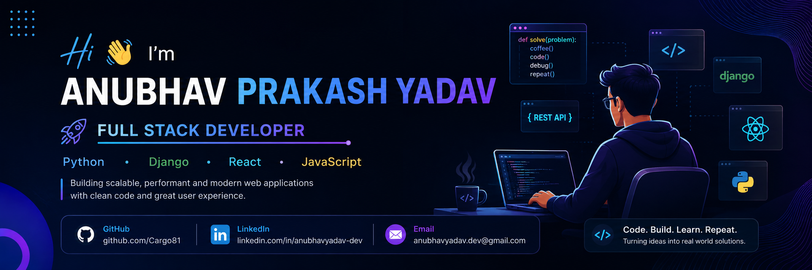

  

# Hi 👋, I'm Anubhav Prakash Yadav

<h3 align="center">🚀 Full Stack Developer | Python • Django • React • JavaScript</h3>

  

---

## 👨‍💻 About Me

- 🔭 Currently working on **Full Stack Projects**
- 🌱 Learning **Django REST Framework, React & System Design**
- 💬 Ask me about **Python, Django, React, JavaScript**
- 📍 Mumbai, India
- 🎯 Goal: Software Engineer

---

## 🚀 Tech Stack

### Languages

### Frontend

### Backend

### Database

---

## 📂 Featured Projects

### 🛒 Ecommerce Website
- Django REST Framework
- React
- JWT Authentication
- Shopping Cart

### 💼 AI Job Portal
- Resume Upload
- Job Search
- Company Dashboard

### 📚 Student Management System
- CRUD Operations
- Authentication

---

## 📊 GitHub Stats

---

## 🔥 GitHub Streak

---

## 💻 Most Used Languages

---

## 🏆 GitHub Trophies

---

## 🌐 Connect With Me

- GitHub: https://github.com/Cargo81
- LinkedIn: https://www.linkedin.com/in/anubhavyadav-dev/
- Email: yadavanubhav388@gmail.com

---

⭐ Thanks for visiting my profile!
